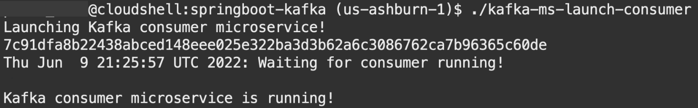
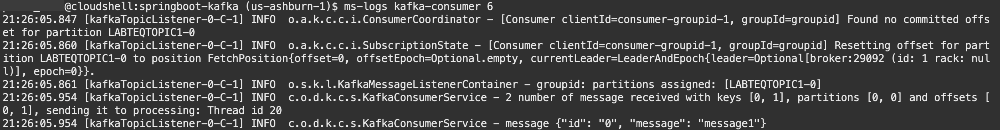

# Build Event-driven microservices with Spring Boot and Apache Kafka

## Introduction

This laboratory helps you know how to build an Event-driven architecture based on Spring Boot microservices that “communicate” asynchronously using Apache Kafka. The laboratory have two microservices, a producer and a consumer, built using Spring Boot framework that connect with an Apache Kafka broker to exchange events.

Estimated Time: 10 minutes

### Objectives

- Deploy and access the Kafka Cluster
- Deploy and access the Kafka Producer Microservice
- Deploy and access the Kafka Consumer Microservice
- Learn how they work

### Prerequisites

- *[Optional]* An Oracle Cloud paid account or free trial. To sign up for a trial account with $300 in credits for 30 days, click [Sign Up](http://oracle.com/cloud/free).
- A Docker Engine accessible.

## **Task 1:** Run Kafka Broker and Create a Topic

1. Check the installed Kafka components executing the following command:

    ```bash
    <copy>
    kafka-status
    </copy>
    ```

    As a result, you will see the following components created:

    ```bash
    NAME                COMMAND                  SERVICE             STATUS              PORTS
    broker              "/etc/confluent/dock…"   broker              created
    connect             "/etc/confluent/dock…"   connect             created
    schema-registry     "/etc/confluent/dock…"   schema-registry     created
    zookeeper           "/etc/confluent/dock…"   zookeeper           created
    ```

2. Start the Kafka infrastructure by running the following command:

    ```bash
    <copy>
    kafka-start
    </copy>
    ```

    This command should return the following lines:

    ```bash
    [+] Running 4/4
    ⠿ Container zookeeper        Started                                                                                                                    0.6s
    ⠿ Container broker           Started                                                                                                                    1.7s
    ⠿ Container schema-registry  Started                                                                                                                    3.1s
    ⠿ Container connect          Started                                                                                                                    4.4s
    KAFKA_RUNNING completed
    ```

3. Once successfully executed, check that the services are running executing the follwing commands:

    ```bash
    <copy>
    kafka-status
    </copy>
    ```

    First, you will see the four containers running, but the container from Connect Service will be *starting*
    

    After a few seconds, the container from Connect Service will be *healthy*
    

    > **Note:** If your cloud shell connection interrupt during the process, may you will have to reconnect and executing the instructions from [Task 5](#task5restartkafkacomponentsoptional).

4. Create a Topic:

    With the Kafka infrastructure ready, you can create a Kafka Topic which will be used during this workshop. A Kafka Topic is a resource where Events are organized and durable stored. A Topic has a unique name across the entire Kafka cluster and there is not the concept of renaming a Topic thus choose a meaningful name that will categorize well the Events handled by it.

    ```bash
    <copy>
    kafka-add-topic LABTEQTOPIC1
    </copy>
    ```

    This command will create the Kafka Topic and configure the properties of the Producer and Consumer microservices to point to the newly created topic.

    ```bash
    Created topic LABTEQTOPIC1
    Configuring Kafka Producer to produce on topic LABTEQTOPIC1.
    Configuring Kafka Producer to consume from topic LABTEQTOPIC1.
    ```

## **Task 2:** Build Kafka producer and consumer microservices

This laboratory adopted the microservices architecture and coded the producer and consumer using the Spring Boot framework and Spring Kafka project to connect with Kafka. Maven is the project management tool, and to build our code, you have to execute the following commands:

```bash
<copy>cd $LAB_HOME/springboot-kafka</copy>
```

```bash
<copy>./kafka-ms-build</copy>
```

As a result of the Maven build task, you should obtain the following lines showing that both Consumer and Producer were successfully built.


## **Task 3:** Produce events with Kafka producer microservice

1. Deploy Kafka producer microservice

    Now that we have the applications successfully built, we can deploy them and test them. Let's start with the Producer. Run these commands to build the image and deploy the Producer inside the Docker Engine (the same running the Kafka Cluster):

    ```bash
    <copy>cd $LAB_HOME/springboot-kafka</copy>
    ```

    ```bash
    <copy>./kafka-ms-deploy-producer</copy>
    ```

    If the deployment task is successful, you will receive the messages below:

    ```bash
    Executing Kafka producer microservice deployment!
    Kafka producer microservices deployment succeeded!
     Step 1/8 : FROM ghcr.io/graalvm/graalvm-ce:ol8-java11 -- Successfully built c2e8cd47b003 Successfully tagged oracle-developers-kafka-producer:0.0.1-SNAPSHOT
    KAFKA_MS_PRODUCER_DEPLOYED completed
    ```

    > **Note:** If the deployment task did not complete correctly, you can investigate the deployment task logs at "$LAB_LOG"/kafka-ms-producer-deployment.log

2. Launch a Kafka producer microservice

    Once you have deployed the producer microservice image, you will be able to launch a container and execute the producer microservice. Issue the follwoing commands:

    ```bash
    <copy>cd $LAB_HOME/springboot-kafka</copy>
    ```

    ```bash
    <copy>./kafka-ms-launch-producer</copy>
    ```

    If the deployment task is successful, you will receive the messages "Kafka producer microservice is running!". Yet it is possible to evaluate the logs from the producer issuing the following command to list the late six lines from the container log:

    ```bash
    <copy>ms-logs kafka-producer 6</copy>
    ```

    

3. Test the Kafka producer microservice

    We will use the cURL command to test our Producer.

    ```bash
    <copy>
    curl -X POST -H "Content-Type: application/json" \
    -d '{ "id": "id1", "message": "message1" } ' \
    http://localhost:8080/placeMessage | jq
    </copy>
    ```

    The result should be

    ```bash
    {
        "id": "0",
        "statusMessage": "Successful"
    }
    ```

    We also can validate if the message was published inside topic LAB8022_TOPIC.

    ```bash
    <copy>
    docker exec --interactive --tty broker \
    kafka-console-consumer --bootstrap-server broker:9092 \
    --topic LAB8022_TOPIC \
    --from-beginning
    </copy>
    ```

    The result will be similar to :

    

    You will need to press Crtl+C to stop this process.

## **Task 2:** Verify configurations and build applications

The Kafka Producer and Consumer adopt Spring Boot and Spring Kafka frameworks. The Producer exposes a REST service that will produce a message and publish it in the Kafka Broker created. And on the other side, the Consumer will subscribe to the same topic and consume messages—a straightforward and typical case but instructive and essential when compared with the next lab.

This workshop makes the source codes of the two microservices available; We invite you to investigate the code to familiarize yourself with Spring Boot and how it connects with Apache Kafka, which allows for asynchronous communication between microservices. After this navigation, you must confirm the microservices settings present in a properties file, following microservices [External Configuration Pattern](https://microservices.io/patterns/externalized-configuration.html) and also the third factor of [Twelve Factor Methodology](https://12factor.net).

1. Review Producer microservices properties

    You have to review the Producer microservice properties to confirm connecting with the right Apache Kafka Broker and Topic. Remember that both were configured during workshop setup tasks, and Kafka Broker runs at address Broker:9092. But, as we are working on the Docker engine from the Cloud Shell environment, Kafka broker is advertised for other nodes on port 29092.

    To verify the producer configuration, you can execute the follow command:

    ```bash
    <copy>cat $LAB_HOME/springboot-kafka/kafka-producer/src/main/resources/application.yaml</copy>
    ```

    The proper configuration should be:

    - bootstrap-servers: broker:29092
    - topic-name: LAB8022_TOPIC

    

2. Review the Consumer Configurations

    Following the same concepts and practices of Producer, Consumer microservice has its configuration externalized and should point to the right Apache Kafka broker that Producer is connected. The following command allows you to list the contents of Consumer properties.

    ```bash
    <copy>cat $LAB_HOME/springboot-kafka/kafka-consumer/src/main/resources/application.yaml</copy>
    ```

    And, likewise in the Producer case, the Consumer should point to the above bootstrap servers and topic.

    > **Note:** If you change these configurations, you will have to modify these parameters.


2. Test Kafka Producer Microservice


## **Task 4:** Deploy and Test Spring Boot Kafka Consumer

Now that we have Producer running and publishing events inside the Kafka Broker, you will do the same with Consumer.

1. Deploy Kafka Consumer Microservice

    We will follow the same steps to deploy and test the Kafka Consumer microservice. Run these commands to build the image and deploy the Consumer inside the Docker Engine (the same running the Kafka Cluster):

    ```bash
    <copy>cd $LAB_HOME/springboot-kafka/kafka-consumer</copy>
    ```

    ```bash
    <copy>./build.sh</copy>
    ```

    Now, let's run the Consumer :

    ```bash
    <copy>
    docker run --detach --name=kafka-consumer --network lab8022network oracle-developers-kafka-consumer:0.0.1-SNAPSHOT
    </copy>
    ```

    We can check the logs and see the Consumer running:

    ```bash
    <copy>
    docker logs kafka-consumer
    </copy>
    ```

    

    And finally, We can now produce and consume messages from Kafka Broker; the result inside logs of Consumer will be:

    

## **Task 5:** Restart Kafka Components (optional)

You session of cloud shell may expire or disconnect during the process [bellow image] thus you will have to check if the Kafka components are still running and if not restart them following the next commands:


1. Setup environment.

    After reconnect you have to setup environment running the following command:

    ```bash
    <copy>
    source $LAB_HOME/cloud-setup/env.sh
    </copy>
    ```

2. Check if Kafka components are running.

    Execute the following command to check if Kafka Components are running:

    ```bash
    <copy>
    cd $LAB_HOME/cloud-setup/confluent-kafka
    </copy>
    ```

    ```bash
    <copy>
    ./docker-compose ps
    </copy>
    ```

    You should see the four containers running
    

3. Restart components

    If they are not running like bellow image, execute again [Task 1](#task1runkafkabrokerandcreateatopic).

    

You may now **proceed to the next lab**

## Acknowledgements

- **Authors** - Paulo Simoes, Developer Evangelist; Paul Parkinson, Developer Evangelist; Richard Exley, Consulting Member of Technical Staff, Oracle MAA and Exadata
- **Contributors** - Mayank Tayal, Developer Evangelist; Sanjay Goil, VP Microservices and Oracle Database
- **Last Updated By/Date** - Paulo Simoes, March 2022
